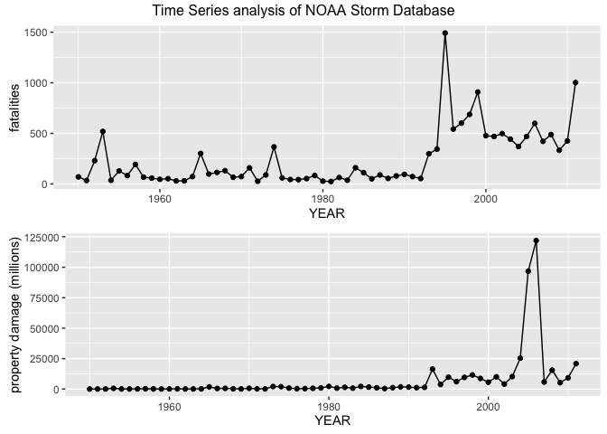
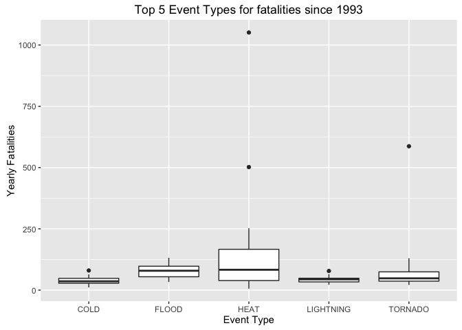
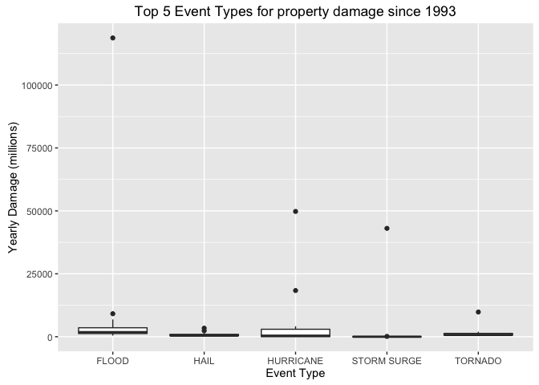

# Reproducible Research: Peer Assessment 2
## Synopsis  
Need to put summary here


## Load libraries

```r
suppressPackageStartupMessages({
  require(data.table)
  require(dplyr)
  require(lubridate)
  require(ggplot2)
  require(grid)
  require(gridExtra)
  })
```

## Data Processing


```r
fix_EVTYPE <- function(x, grep_string, replace_string) {
  idx <- grepl(grep_string, x$EVTYPE, ignore.case = TRUE )
  res <- x
  if( sum(idx) > 0 ) {
    cat('Found', paste0(unique(x[idx,'EVTYPE']), collapse=', '), '\n')
    cat('Replacing with', replace_string, '\n' )
    res[idx,'EVTYPE'] <- replace_string
  }
  return(res)
}

raw_data <- read.csv('repdata%2Fdata%2FStormData.csv.bz2', stringsAsFactors = FALSE)

clean_data <- as.data.table(raw_data) %>%
                mutate(YEAR = year(mdy_hms(BGN_DATE))) %>%
                mutate(PROPDMGVAL = PROPDMG * ifelse( PROPDMGEXP == 'K', 1e-3,
                                              ifelse( PROPDMGEXP == 'M', 1,
                                              ifelse( PROPDMGEXP == 'B', 1e3, 0))))

clean_data <- fix_EVTYPE(clean_data, 'hurricane', 'HURRICANE')
```

```
## Found HURRICANE OPAL/HIGH WINDS, HURRICANE ERIN, HURRICANE OPAL, HURRICANE, HURRICANE-GENERATED SWELLS, HURRICANE EMILY, HURRICANE GORDON, HURRICANE FELIX, Hurricane Edouard, HURRICANE/TYPHOON 
## Replacing with HURRICANE
```

```r
clean_data <- fix_EVTYPE(clean_data, 'TSTM|thunderstorm', 'THUNDERSTORM')
```

```
## Found TSTM WIND, THUNDERSTORM WINDS, THUNDERSTORM WIND, THUNDERSTORM WINS, THUNDERSTORM WINDS LIGHTNING, THUNDERSTORM WINDS/HAIL, THUNDERSTORM WINDS HAIL, FLASH FLOODING/THUNDERSTORM WI, THUNDERSTORM, THUNDERSTORM WINDS/FUNNEL CLOU, SEVERE THUNDERSTORM, SEVERE THUNDERSTORMS, SEVERE THUNDERSTORM WINDS, THUNDERSTORMS WINDS, THUNDERSTORMS, LIGHTNING THUNDERSTORM WINDSS, THUNDERSTORM WINDS 60, THUNDERSTORM WINDSS, TORNADOES, TSTM WIND, HAIL, LIGHTNING THUNDERSTORM WINDS, LIGHTNING AND THUNDERSTORM WIN, THUNDERSTORM WINDS53, THUNDERSTORM WINDS 13, THUNDERSTORM WINDS URBAN FLOOD, THUNDERSTORM WINDS SMALL STREA, THUNDERSTORM WINDS 2, TSTM WIND 51, TSTM WIND 50, TSTM WIND 52, TSTM WIND 55, THUNDERSTORM WINDS 61, THUNDERSTORM DAMAGE, THUNDERSTORMW 50, THUNDERSTORMS WIND, THUNDERSTORM  WINDS, THUNDERSTORM WINDS/ HAIL, THUNDERSTORM WIND/LIGHTNING, THUNDERSTORM WIND G50, THUNDERSTORM WINDS/HEAVY RAIN, THUNDERSTORM WINDS      LE CEN, THUNDERSTORM WINDS G, THUNDERSTORM WIND G60, THUNDERSTORM WINDS., THUNDERSTORM WIND G55, THUNDERSTORM WINDS G60, THUNDERSTORM WINDS FUNNEL CLOU, THUNDERSTORM WINDS 62, THUNDERSTORM WINDS/FLASH FLOOD, THUNDERSTORM WINDS 53, THUNDERSTORM WIND 59, THUNDERSTORM WIND 52, THUNDERSTORM WIND 69, TSTM WIND G58, THUNDERSTORMW WINDS, THUNDERSTORM WIND 60 MPH, THUNDERSTORM WIND 65MPH, THUNDERSTORM WIND/ TREES, THUNDERSTORM WIND/AWNING, THUNDERSTORM WIND 98 MPH, THUNDERSTORM WIND TREES, THUNDERSTORM WIND 59 MPH, THUNDERSTORM WINDS 63 MPH, THUNDERSTORM WIND/ TREE, THUNDERSTORM DAMAGE TO, THUNDERSTORM WIND 65 MPH, THUNDERSTORM WIND., THUNDERSTORM WIND 59 MPH., THUNDERSTORM HAIL, THUNDERSTORM WINDSHAIL, THUNDERSTORM WINDS AND, TSTM WIND DAMAGE, THUNDERSTORM WINDS 50, THUNDERSTORM WIND G52, THUNDERSTORM WINDS 52, THUNDERSTORM WIND G51, THUNDERSTORM WIND G61, THUNDERSTORM WINDS/FLOODING, THUNDERSTORM W INDS, THUNDERSTORM WIND 50, THUNDERSTORM WIND 56, THUNDERSTORM WIND/HAIL, THUNDERSTORMW, TSTM WINDS, TSTMW, TSTM WIND 65), THUNDERSTORM WINDS/ FLOOD, THUNDERSTORMWINDS, THUNDERSTORM WINDS HEAVY RAIN, TSTM WIND/HAIL, Tstm Wind, Thunderstorm Wind, TSTM WIND (G45), TSTM HEAVY RAIN, TSTM WIND 40, TSTM WIND 45, TSTM WIND (41), TSTM WIND (G40), TSTM WND,  TSTM WIND, TSTM WIND AND LIGHTNING,  TSTM WIND (G45), TSTM WIND  (G45), TSTM WIND (G35), TSTM, TSTM WIND G45, THUNDERSTORM WIND (G40), NON-TSTM WIND, NON TSTM WIND, GUSTY THUNDERSTORM WINDS, MARINE TSTM WIND, GUSTY THUNDERSTORM WIND, MARINE THUNDERSTORM WIND 
## Replacing with THUNDERSTORM
```

```r
clean_data <- fix_EVTYPE(clean_data, 'heat', 'HEAT')
```

```
## Found HEAT, EXTREME HEAT, EXCESSIVE HEAT, RECORD HEAT, HEAT WAVE, DROUGHT/EXCESSIVE HEAT, RECORD HEAT WAVE, RECORD/EXCESSIVE HEAT, HEAT WAVES, HEAT WAVE DROUGHT, HEAT/DROUGHT, HEAT DROUGHT, Heatburst, Record Heat, Heat Wave, EXCESSIVE HEAT/DROUGHT 
## Replacing with HEAT
```

```r
clean_data <- fix_EVTYPE(clean_data, 'flood', 'FLOOD')
```

```
## Found ICE STORM/FLASH FLOOD, FLASH FLOOD, FLASH FLOODING, FLOODING, FLOOD, BREAKUP FLOODING, RIVER FLOOD, COASTAL FLOOD, FLOOD WATCH/, FLASH FLOODS, FLOODING/HEAVY RAIN, HEAVY SURF COASTAL FLOODING, URBAN FLOODING, URBAN/SMALL FLOODING, LOCAL FLOOD, FLOOD/FLASH FLOOD, FLOOD/RAIN/WINDS, FLASH FLOOD WINDS, URBAN/SMALL STREAM FLOODING, STREAM FLOODING, FLASH FLOOD/, FLOOD/RAIN/WIND, SMALL STREAM URBAN FLOOD, URBAN FLOOD, HEAVY RAIN/FLOODING, COASTAL FLOODING, HIGH WINDS/FLOODING, URBAN/SMALL STREAM FLOOD, MINOR FLOODING, URBAN/SMALL STREAM  FLOOD, URBAN AND SMALL STREAM FLOOD, SMALL STREAM FLOODING, FLOODS, SMALL STREAM AND URBAN FLOODIN, SMALL STREAM/URBAN FLOOD, SMALL STREAM AND URBAN FLOOD, RURAL FLOOD, MAJOR FLOOD, ICE JAM FLOODING, STREET FLOOD, SMALL STREAM FLOOD, LAKE FLOOD, URBAN AND SMALL STREAM FLOODIN, RIVER AND STREAM FLOOD, MINOR FLOOD, HIGH WINDS/COASTAL FLOOD, RIVER FLOODING, FLOOD/RIVER FLOOD, MUD SLIDES URBAN FLOODING, HEAVY SNOW/HIGH WINDS & FLOOD, HAIL FLOODING, HEAVY RAIN AND FLOOD, LOCAL FLASH FLOOD, FLOOD/FLASH FLOODING, COASTAL/TIDAL FLOOD, FLASH FLOOD/FLOOD, FLASH FLOOD FROM ICE JAMS, FLASH FLOOD - HEAVY RAIN, FLASH FLOOD/ STREET, FLASH FLOOD/HEAVY RAIN, HEAVY RAIN; URBAN FLOOD WINDS;, FLOOD FLASH, FLOOD FLOOD/FLASH, TIDAL FLOOD, FLOOD/FLASH, HEAVY RAINS/FLOODING, HIGHWAY FLOODING, FLASH FLOOD/ FLOOD, HEAVY RAIN/MUDSLIDES/FLOOD, BEACH EROSION/COASTAL FLOOD, SNOWMELT FLOODING, FLASH FLOODING/FLOOD, BEACH FLOOD, FLOOD & HEAVY RAIN, FLOOD/FLASHFLOOD, URBAN SMALL STREAM FLOOD, URBAN FLOOD LANDSLIDE, URBAN FLOODS, HEAVY RAIN/URBAN FLOOD, FLASH FLOOD/LANDSLIDE, LANDSLIDE/URBAN FLOOD, FLASH FLOOD LANDSLIDES, Minor Flooding, Ice jam flood (minor, Coastal Flooding, COASTALFLOOD, Erosion/Cstl Flood, Tidal Flooding, River Flooding, Flood/Flash Flood, STREET FLOODING, Flood, TIDAL FLOODING,  COASTAL FLOOD, Urban Flooding, Urban flood, Urban Flood, Coastal Flood, coastal flooding, Flood/Strong Wind, COASTAL FLOODING/EROSION, URBAN/STREET FLOODING, COASTAL  FLOODING/EROSION, FLOOD/FLASH/FLOOD,  FLASH FLOOD, CSTL FLOODING/EROSION, LAKESHORE FLOOD 
## Replacing with FLOOD
```

```r
clean_data <- fix_EVTYPE(clean_data, 'cold|winter', 'COLD')
```

```
## Found WINTER STORM, RECORD COLD, COLD, EXTREME COLD, RECORD COLD AND HIGH WIND, WINTER STORM/HIGH WIND, WINTER STORM/HIGH WINDS, WINTER STORM HIGH WINDS, WINTER STORMS, WINTER WEATHER, UNSEASONABLY COLD, EXTREME/RECORD COLD, SEVERE COLD, COLD WAVE, COLD AND WET CONDITIONS, COLD AIR FUNNEL, COLD AIR FUNNELS, COLD AIR TORNADO, PROLONG COLD, HEAVY SNOW/WINTER STORM, BLIZZARD/WINTER STORM, FOG AND COLD TEMPERATURES, SNOW/COLD, RECORD COLD/FROST, RECORD SNOW/COLD, HIGH WINDS/COLD, COLD/WINDS, SNOW/ BITTER COLD, COLD WEATHER, SNOW AND COLD, PROLONG COLD/SNOW, SNOW\COLD, WINTER MIX, Unseasonable Cold, Record Cold, Extreme Cold, Excessive Cold, Winter Weather, Extended Cold, Record Winter Snow, Cold, Cold Temperature, COLD AND SNOW, Prolong Cold, Cold and Frost, COLD AND FROST, WINTERY MIX, COLD TEMPERATURES, COLD WIND CHILL TEMPERATURES, RECORD  COLD, UNUSUALLY COLD, WINTER WEATHER MIX, WINTER WEATHER/MIX, EXTREME COLD/WIND CHILL, COLD/WIND CHILL 
## Replacing with COLD
```

```r
clean_data <- fix_EVTYPE(clean_data, 'rip', 'RIP')
```

```
## Found RIP CURRENT, RIP CURRENTS HEAVY SURF, RIP CURRENTS/HEAVY SURF, RIP CURRENTS 
## Replacing with RIP
```

## Selection of time period

Using recent data has 2 advantages
Database is more complete
Reflective of recent climatic conditions but more importantly
reflective of CURRENT infrastructure and support.
That is, don't want to have a response to damage/fatalities that
have previously occurred where infrastructure and/or support
has already been CHANGED


```r
time_data <- group_by(clean_data, YEAR) %>%
               summarise(total_death  = sum(FATALITIES),
                         total_damage = sum(PROPDMGVAL)
                        )

death_plot <- qplot(YEAR,
                    total_death,
                    data = time_data,
                    ylab = 'total fatalities',
                    geom = c('point', 'line')
                   )      

damage_plot <- qplot(YEAR,
                     total_damage,
                     data = time_data,
                     ylab = 'total damage (millions)',
                     geom = c('point', 'line')
                    )

grid.arrange( death_plot, damage_plot, ncol=1)
```

<!-- -->

```r
recent_data <- filter( clean_data, YEAR >= 1993 )
```

## Results

HEAT causes most deaths on average over the considered time period.  
In addition, this type has highest number of deaths in a single year.  
FLOOD has next most deaths on average, although TORNADO has second highest number  
of deaths in a single year.  


```r
# Cannot use mean function within summarise because this will group by event types
# and take the average over the series of individual events

n_years <- length(unique(recent_data$YEAR))

avg_death_by_type <- group_by(recent_data, EVTYPE)        %>%
                       summarise(total = sum(FATALITIES)) %>%
                       mutate(avg = total / n_years)      %>%
                       arrange(desc(avg))

idx <- recent_data$EVTYPE %in% avg_death_by_type$EVTYPE[1:5]

top_5_data <- recent_data[idx,]

death_data <- group_by(top_5_data, YEAR, EVTYPE) %>%
                summarise(total = sum(FATALITIES))

qplot(EVTYPE,
      total,
      data = death_data,
      geom = 'boxplot',
      xlab = 'Event Type',
      ylab = 'Yearly Fatalities',
      main = 'Top 5 Event Types for fatalities since 1993'
      )
```

<!-- -->

```r
cat('NOTE: Boxplot removes outliers when determining average\n\n')
```

```
## NOTE: Boxplot removes outliers when determining average
```

```r
cat('Table of Average Yearly Fatalities for Top 5 Event Types\n')
```

```
## Table of Average Yearly Fatalities for Top 5 Event Types
```

```r
print(avg_death_by_type[1:5,])
```

```
## # A tibble: 5 x 3
##      EVTYPE total       avg
##       <chr> <dbl>     <dbl>
## 1      HEAT  3138 165.15789
## 2   TORNADO  1621  85.31579
## 3     FLOOD  1525  80.26316
## 4 LIGHTNING   816  42.94737
## 5      COLD   729  38.36842
```

```r
#----------------------------------

avg_damage_by_type <- group_by(recent_data, EVTYPE)       %>%
                       summarise(total = sum(PROPDMGVAL)) %>%
                       mutate(avg = total / n_years)      %>%
                       arrange(desc(avg))

idx <- recent_data$EVTYPE %in% avg_damage_by_type$EVTYPE[1:5]

top_5_data <- recent_data[idx,]

damage_data <- group_by(top_5_data, YEAR, EVTYPE) %>%
                summarise(total = sum(PROPDMGVAL))

qplot(EVTYPE,
      total,
      data = damage_data,
      geom = 'boxplot',
      xlab = 'Event Type',
      ylab = 'Yearly Damage (millions)',
      main = 'Top 5 Event Types for property damage since 1993'
      )
```

<!-- -->

```r
cat('NOTE: Boxplot removes outliers when determining average\n\n')
```

```
## NOTE: Boxplot removes outliers when determining average
```

```r
cat('Table of Average Yearly Property Damage (millions) for Top 5 Event Types\n')
```

```
## Table of Average Yearly Property Damage (millions) for Top 5 Event Types
```

```r
print(avg_damage_by_type[1:5,])
```

```
## # A tibble: 5 x 3
##        EVTYPE     total       avg
##         <chr>     <dbl>     <dbl>
## 1       FLOOD 167529.22 8817.3271
## 2   HURRICANE  84736.18 4459.7989
## 3 STORM SURGE  43323.54 2280.1861
## 4     TORNADO  26327.46 1385.6559
## 5        HAIL  15727.37  827.7561
```
